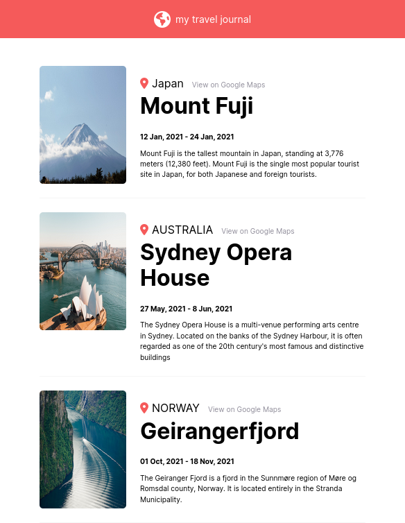

# Travel Journal

This is a simple project that I completed for part two of React basic course where I learned how to use props and mapping. The project is called Travel Journal and it dynamically gets the data from an external file that holds an array of objects, which are later used to populate the content of the webpage.


## Screenshot


## Live Version


You can check out the live version of this project [here](https://raees-travel-journal.netlify.app/).

## Installation

To run this project locally, you need to have Node.js and Git installed on your computer. Then, follow these steps:


```bash
git clone https://github.com/Abbaraees/travel-journal.git
cd travel-journal
npm install
npm run dev
```

## Usage

You can use this project to create a simple travel journal to document your trips. To add new trips, simply edit the src/data.js file by adding new objects to the trips array. 

## Contributing
If you find any issues or bugs in this project, feel free to open an issue or submit a pull request. Any contributions are welcome!
License
